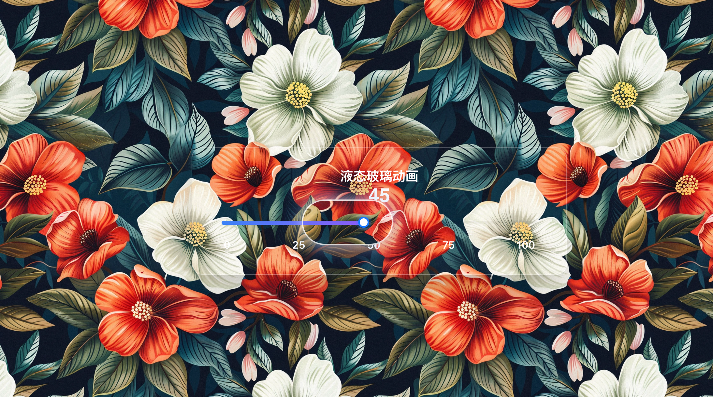

# 🌊 Liquid Glass with Delay Effects

一个基于延迟跟随物理的液体玻璃效果实现，为滑块组件添加真实的液体惯性。



## 🙏 致谢

特别感谢以下开源项目的贡献：

- **[@shuding/liquid-glass](https://github.com/shuding/liquid-glass)** - 提供了核心的 `glass.js` 实现和 SVG 滤镜技术
- **[@rdev/liquid-glass-react](https://github.com/rdev/liquid-glass-react)** - 思路和实现参考

## ✨ 创新特性

### 🎯 延迟跟随液体物理系统
- **真实液体惯性**: 滤镜组件具有延迟跟随效果，模拟真实液体的物理特性
- **智能性能优化**: 继承了 glass.js 的 mouseProxy 机制，只在需要时更新渲染
- **流畅交互**: 基于 requestAnimationFrame 的平滑动画循环

### 🎮 主页滑块演示
在主页 `src/app/(dashboard)/page.tsx` 中实现了延迟效果滑块：
- 拖拽滑块时，液体玻璃跟随手柄位置
- 具有延迟跟随效果，模拟真实液体的惯性
- 松开后液体逐渐回到静止状态

## 🚀 快速开始

```bash
# 安装依赖
yarn install

# 启动开发服务器
yarn dev

# 访问主页查看延迟效果演示
# http://localhost:3000
```

## 🎨 核心组件

### DelayedFilter 延迟滤镜组件

```tsx
import DelayedFilter from '@/components/DelayedFilter';

<DelayedFilter
  width={90}
  height={50}
  targetPosition={glassPosition}
  isDragging={isDragging}
  delayStrength={0.3} // 延迟强度，越小延迟越明显
/>
```

## 🔧 技术实现

- **延迟算法**: `currentPosition + (targetPosition - currentPosition) * delayStrength`
- **性能优化**: 智能鼠标代理机制，避免无效渲染
- **物理模拟**: requestAnimationFrame 驱动的连续动画更新

## 📁 项目结构

```
src/
├── components/
│   ├── DelayedFilter.tsx    # 延迟跟随滤镜组件
│   ├── LiquidGlass.tsx      # 基础液体玻璃组件
│   └── Shader.ts            # 核心着色器逻辑
└── app/(dashboard)/
    └── page.tsx             # 主页 - 延迟效果滑块演示
```
